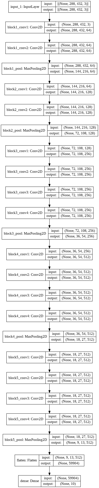
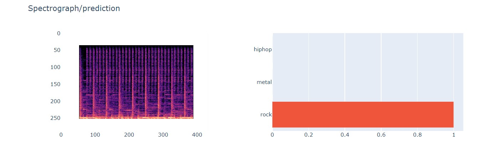

<h1> Music Classification </h1>
<h3>This machine learning algorithm can predict which type of music is being played (classical/jazz/rock and so on...)</h3>
<i> <b>mnist_test.csv consists of lots of wav files, each graphically labelled and each crest and trough is recognised. All the patterns of the graphs make music type classification possible.</b> For Example, Rock music would have deep basses, making their musics' crest and trough go deeper and the rythmic pattern appearing more frequent as rock music are generally fast paced. Classical music would have soft crests which maked distinguishing easier. Ofcourse there may be a few exceptions; that's what machine learning is all about, to learn the given datasets and perform recognition upon the test subjects. Exceptions in the datasets are also thouroughlly labelled and they help im increasing the accuracy of the model. </i>

<h2> Model representation </h2>

<h2> Result prediction </h2>
    <h3> A sample representation of how the result is predicted and how the accuracy is shown.  <i>Note: The following test subject was probably a part of the dataset which is why the accuracy is 100%, but also doubt-categories are shown on it's side, the subject must be closely related to hip-hop or metal category. </i>
    

<h2>The directory includes a datasets which are used to build this model. </h2>

*   `california_housing_data*.csv` is California housing data from the 1990 US
    Census; more information is available at:
    https://developers.google.com/machine-learning/crash-course/california-housing-data-description

*   `mnist_*.csv` is a small sample of the
    [MNIST database](https://en.wikipedia.org/wiki/MNIST_database), which is
    described at: http://yann.lecun.com/exdb/mnist/

*   `anscombe.json` contains a copy of
    [Anscombe's quartet](https://en.wikipedia.org/wiki/Anscombe%27s_quartet); it
    was originally described in

    Anscombe, F. J. (1973). 'Graphs in Statistical Analysis'. American
    Statistician. 27 (1): 17-21. JSTOR 2682899.

    and our copy was prepared by the
    [vega_datasets library](https://github.com/altair-viz/vega_datasets/blob/4f67bdaad10f45e3549984e17e1b3088c731503d/vega_datasets/_data/anscombe.json).
